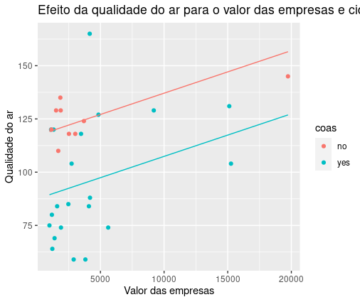

# Analise qualidade do ar R

Analise de dados da library "Ecdat", para verificar os dados da qualidade do ar do dataframe Airq.
Utilizei o GGplot para o plot dos graficos e o GGpredict para a criação de um html interativo com a relação de significância do p-valor das relações entre: (Qualidade do ar ~ Cidade costeira + Valor das empresas) 

## 🚀 Começando

Download do Script na pasta SRC e implementar ele no RStudio 

### 📋 Pré-requisitos

Um nevegador web e uma conexão com a internet

## 🎯 Demonstrações

Link para demonstração do site da regressão multipla interativa ---> [Site interativo](https://bruno-gdos.github.io/Analise_QualidadeAr_R/Graficos/Grafico_RegMult_Int.html)

## 🖇️ Colaborando

Por favor, se deseja coloborar enviar e-mail para bruno.gdscosta@gmail.com

## ✒️ Autores

* **Bruno Gabriel dos Santos Costa** - *Todo o trabalho* - [Bruno Gabriel](https://github.com/Bruno-Gdos)

---
⌨️ com ❤️ por [Bruno Gabriel](https://github.com/Bruno-Gdos) 😊
